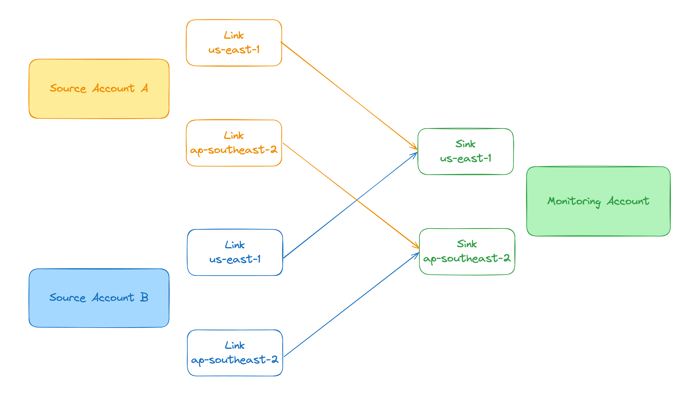
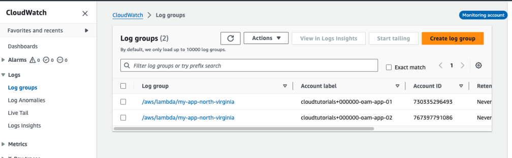
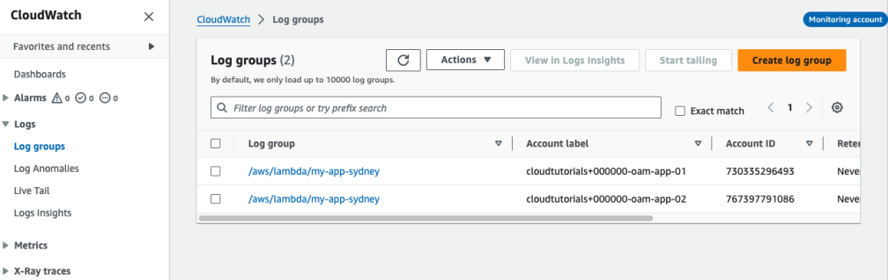
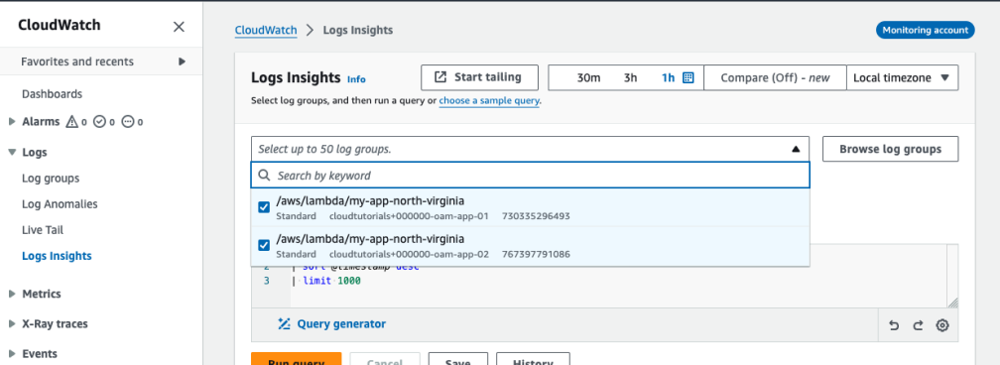

# Create CloudWatch Observability Access Manager (OAM) with SST Ion

CloudWatch OAM empowers you to centralize and connect a region in multiple accounts (named Source accounts) into the same region in a destination account (named Monitoring account).

For example:

-   Source account A us-east-1 => Monitoring account us-east-1
-   Source account B us-east-1 => Monitoring account us-east-1

Using the CloudWatch dashboard in Monitoring account us-east-1, you can see logs, metrics, trances and insights from Source accounts A and B.

-   Source account A ap-southeast-2 => Monitoring account ap-southeast-2
-   Source account B ap-southeast-2 => Monitoring account ap-southeast-2

Using the CloudWatch dashboard in Monitoring account ap-southeast-2, you can see logs, metrics, trances and insights from Source accounts A and B.

## CloudWatch OAM Constructs

You work with two components when configuring CloudWatch OAM:

-   **Sink**: A Sink represents a destination point where AWS accounts running workloads (named Source accounts) will send their logs, metrics, trace and insights to. You create Sinks in the Monitoring account. You can create a single Sink per region in the Monitoring account. A Monitoring account can be connected to as many as 100,000 Source accounts.

-   **Link**: A Link is a resource that represents the connection between the "Source account" and the Monitoring account. You create a Link in the AWS accounts running workloads where logs, metrics trace and insights are created. You can multiple Links per region in the Source account. A Source account can be paired with up to five monitoring accounts concurrently.

## The example in this repository

This repository shows how to configure [CloudWatch Observability Access Manager (OAM)](https://docs.aws.amazon.com/OAM/latest/APIReference/Welcome.html) for multi-account logs, metrics, traces and insights.

We'll use the example described in the introduction above for our technical implementation. We are going to connect two regions from two Source accounts into the Monitoring account.

Check out the [sst.config.ts](sst.config.ts) for more details.

## Final results

After deploying this example, you can generate logs, metrics, traces and insights in the Source accounts and they will be available for analysis and visualization in the Monitoring account.

In the Monitoring account CloudWatch Logs dashboard in us-east-1, I can see logs from both Source accounts:

In the Monitoring account CloudWatch Logs dashboard in ap-southeast-2, I can see logs from both Source accounts:

In the Monitoring account CloudWatch Logs dashboard in us-east-1, I can use Log Insights to query log groups from both Source accounts and inspect my log events:

